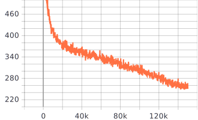

# SinglePathOneShotNAS-Gluon

## Gloun Version of SinglePathOneShotNAS

Official [Pytorch](https://github.com/megvii-model/SinglePathOneShot) Implementation 

[Single Path One-Shot Neural Architecture Search with Uniform Sampling](https://arxiv.org/abs/1904.00420)

## Prepare

### Packages

`pip install mxnet-cu101mkl`(depend on you CUDA version)

`pip install gluoncv`

`pip install mxboard`

`pip install --extra-index-url https://developer.download.nvidia.com/compute/redist/cuda/10.0 nvidia-dali`

`pip install horovod`

`pip install mxop`(Optional)

### Dataset

`cd $ROOT && mkdir data`

`cd data && ln -s path/to/imagenet_image_dir/ ./` or `cd data && ln -s path/to/imagenet_rec_dir/ ./`

## SuperNet

Train supernet with:`sh train_supernet.sh`

Remark: Make sure your dataset path is correct before training.

;Train_Accuracy_Curves:

;

;Train_Loss_Curves:

;

;Val_Accuracy_Curves:

;

## Search

Search subnet with flops/params limits:`sh search.sh`

Remark: Change `resume-params` in `search.py` or `search.sh`, also you should make sure your dataset path is correct before searching, change flops/params limit if you like.

## Evaluate

Retrain the best subnet:`sh eval.sh`

Remark: Make sure your dataset path is correct before retraining.

## Reference

https://github.com/megvii-model/SinglePathOneShot

https://gluon-cv.mxnet.io/model_zoo/classification.html

https://github.com/CanyonWind/Single-Path-One-Shot-NAS-MXNet

https://github.com/hey-yahei/OpSummary.MXNet

